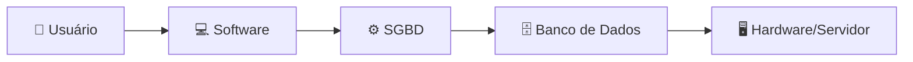

# 🗄️ Introdução a Bancos de DadoS

---

## 🎯 O que são bancos de dados e para que servem

### 🌐 Importância no cotidiano

Mesmo sem percebermos, estamos constantemente interagindo com bancos de dados:

🍕 **Quando você pede comida pelo aplicativo**  
📱 **Quando acessa suas redes sociais**  
🛒 **Quando faz compras online**

> Todas as informações que aparecem na tela do seu aplicativo são gerenciadas por algum banco de dados nos bastidores.

---

### 💡 O que é um Banco de Dados?

**Definição:** Uma coleção organizada e estruturada de informações que podem ser acessadas facilmente, atualizadas e gerenciadas.

🔑 **Palavra-chave:** **ORGANIZADA** - essa é a característica fundamental

#### 📖 Definição técnica:

> *"Um banco de dados é uma coleção lógica e coerente de dados com significado inerente, projetado, construído e populado com dados para um propósito específico."*
> 
> **— C.J. Date, em "Introdução a Sistemas de Bancos de Dados"**

---

### 🎭 Analogia prática

Imagine que você trabalhe numa loja e precisa encontrar rapidamente uma **nota fiscal específica** em uma pilha gigantesca de papéis bagunçados. 

😰 Seria bem complicado, né?

✨ É exatamente nesse tipo de problema que os bancos de dados resolvem para nós no mundo digital.

---

### 📝 Exemplos práticos para entender

#### 📞 Agenda de contatos do celular
- **Registro:** cada contato
- **Campo:** nome, telefone, e-mail

#### 📊 Planilha de gastos mensais (Excel)
- **Registro:** cada linha representa um gasto específico
- **Campo:** cada coluna representa um detalhe (data, valor, categoria)

---

### 🧠 Conceitos-chave

| Conceito | Definição |
|----------|-----------|
| **📊 Dados** | Informações brutas, como números ou palavras |
| **ℹ️ Informações** | Dados organizados e estruturados que fazem sentido |
| **📝 Registro (linha)** | Item específico, cada entrada individual na tabela |
| **📋 Campo (coluna)** | Detalhe sobre cada item, características dos registros |

---

### ⚙️ SGBD - Sistema Gerenciador de Banco de Dados

**O que é:** Software responsável por controlar, manipular e gerenciar o acesso aos dados

**🔧 Exemplos de SGBDs relacionais:**
- 🐘 **PostgreSQL** - Robusto e open source
- 🐬 **MySQL** - Popular e amplamente usado  
- 🏢 **Microsoft SQL Server** - Solução enterprise
- 🔶 **Oracle Database** - Líder em grandes corporações
- 🪶 **SQLite** - Leve para aplicações menores

**🎯 Função:** Gerencia como acessamos, manipulamos, modificamos e excluímos dados

---

### 🔄 Como funciona o fluxo



1. **🖥️ Hardware/Servidor:** Máquina onde está instalado o SGBD
2. **⚙️ SGBD:** Sistema que gerencia múltiplos bancos
3. **🗄️ Bancos de Dados:** Local dos dados em tabelas
4. **💻 Software:** Aplicações que fazem requisições (SQL)
5. **👤 Usuários:** Pessoas que acessam via softwares

---

### 🔒 Segurança e backup

Os dados ficam protegidos com:
- 💾 **Backup automático**
- 🛡️ **Salvamento seguro** 
- 🚫 **Proteção contra perda**

---

## 🚀 Por que os Bancos de Dados Relacionais são Importantes?

### ⚡ Principais benefícios

#### 1️⃣ **📈 Organização e rapidez**
- ⚡ Acesso em **milissegundos**
- 🔍 Busca eficiente em grandes volumes
- 📋 Informação disponível instantaneamente

#### 2️⃣ **🛡️ Integridade e segurança**
- ✅ **Consistência:** Dados sempre atualizados
- 🔒 **Segurança:** Proteção total contra perda
- 💾 **Backup:** Informações mantidas seguras
- 🎫 **Controle de acesso:** Permissões rigorosas

#### 3️⃣ **🏗️ Suporte a aplicações complexas**
- 📊 Gerenciamento de **milhões de dados** simultaneamente
- 🏦 **Aplicativos bancários** 
- 🛍️ **Sistemas de e-commerce**
- 💼 **Sistemas empresariais (ERP, CRM)**

---

### 🏦 Exemplo detalhado: Aplicativo bancário

Para funcionar adequadamente, precisa gerenciar:

| Área | Dados Gerenciados |
|------|-------------------|
| 👤 **Cliente** | Informações pessoais e cadastrais |
| 💳 **Contas** | Saldos em tempo real |
| 💸 **Transações** | Histórico completo de movimentações |
| 🔐 **Segurança** | Controle de acesso e autenticação |

> Todas essas operações dependem de um **banco relacional robusto** funcionando nos bastidores.

---

### 📊 Representação visual: Analogia com Excel

#### 🏗️ Estrutura do Banco

| Conceito | Excel | Banco de Dados |
|----------|-------|----------------|
| 📁 **Container** | Arquivo Excel | Banco de dados |
| 📋 **Organização** | Planilhas | Tabelas |
| 📝 **Entradas** | Linhas | Registros |
| 📊 **Características** | Colunas | Campos |

#### 👥 Exemplo prático - Tabela "Usuários"

| ID | Nome   | Email              | Senha    | Telefone      | Ativo |
|----|--------|--------------------|----------|---------------|-------|
| 1  | Ana    | ana@email.com      | ••••••   | (11)99999-1111| ✅ TRUE  |
| 2  | João   | joao@email.com     | ••••••   | (11)99999-2222| ❌ FALSE |
| 3  | Felipe | felipe@email.com   | ••••••   | (11)99999-3333| ❌ FALSE |
| 4  | Maria  | maria@email.com    | ••••••   | (11)99999-4444| ✅ TRUE  |
| 5  | Bruno  | bruno@email.com    | ••••••   | (11)99999-5555| ✅ TRUE  |

#### 🔍 Características importantes

- **🆔 ID:** Identificador único de cada registro
- **🎯 Busca eficiente:** "Quero o Bruno" → ID 5 → Acesso direto
- **📊 Status:** Campo "Ativo" controla cadastros válidos
- **🔗 Múltiplas tabelas:** Usuários, Produtos, Pedidos, Endereços...

---

## 🔗 Bancos de Dados Relacionais (SQL)

### 🎯 O que é um Banco Relacional

#### ⭐ Características fundamentais

🗂️ **Tabelas como estrutura principal (linhas e colunas)**
- 📋 Organização clara e estruturada
- 📝 Cada linha = registro único
- 📊 Cada coluna = atributo específico

💬 **SQL como linguagem padrão**
- 🔤 Structured Query Language
- 🌐 Linguagem universal para dados relacionais
- ⚙️ Operações: criar, consultar, atualizar, deletar

📋 **Exemplo de tabelas: usuários e pedidos**
- 👤 Tabela **usuários:** dados dos clientes
- 🛒 Tabela **pedidos:** compras realizadas
- 🔗 **Relacionamento:** cada pedido pertence a um usuário

#### 🔑 Elementos essenciais

**🗝️ Chave primária**
- 🆔 Identificador único de cada registro
- 🚫 Garante que não existam duplicatas
- 📝 Exemplos: ID do usuário, CPF, código do produto

**🔗 Relações entre tabelas (chave estrangeira)**
- 🌉 Conecta informações de diferentes tabelas
- ✅ Mantém a integridade referencial
- 📝 Exemplo: ID do usuário na tabela de pedidos

#### ✨ Principais vantagens

**📋 Estrutura organizada**
- 🗂️ Dados bem definidos e categorizados
- 🔍 Facilita localização e manipulação
- 🚫 Reduz redundância e inconsistências

**🛡️ Alta integridade dos dados**
- ⚖️ Regras rígidas garantem consistência
- ✅ Validações automáticas
- 🛡️ Proteção contra corrupção

**📊 Ideal para dados estruturados**
- 🎯 Perfeito para informações bem definidas
- 📈 Excelente para relatórios e análises
- 💪 Suporte robusto a transações complexas

---

### 🛍️ Exemplo prático: Sistema de E-commerce

Vamos entender como funciona na prática com duas tabelas relacionadas:

#### 👥 Tabela USUÁRIOS

| ID | Nome  | Email           |
|----|-------|-----------------|
| 1  | João  | joao@email.com  |
| 2  | Maria | maria@email.com |

**🔧 Características da tabela:**
- **🆔 ID:** Chave primária (identificador único)
- **👤 Nome:** Campo texto com validações (não pode ser nulo)
- **📧 Email:** Campo com formato específico e tamanho máximo

#### 🛒 Tabela PEDIDOS

| ID | ID_Usuario | Valor |
|----|------------|-------|
| 1  | 1          | 50.00 |
| 2  | 1          | 80.00 |
| 3  | 2          | 120.00|

**🔧 Características da tabela:**
- **🆔 ID:** Chave primária da tabela pedidos
- **🔗 ID_Usuario:** Chave estrangeira → tabela usuários
- **💰 Valor:** Campo numérico com valor do pedido

#### 🔍 Como funciona o relacionamento

**📖 Interpretação dos dados:**
- **🛒 Pedido 1:** João (ID=1) comprou por R$ 50,00
- **🛒 Pedido 2:** João (ID=1) comprou por R$ 80,00  
- **🛒 Pedido 3:** Maria (ID=2) comprou por R$ 120,00

**🎯 Conceito de abstração:**
Na tabela usuários, incluímos apenas campos **necessários para nosso contexto**. Poderíamos ter telefone, CPF, endereço, mas para nosso exemplo, ID, nome e email são suficientes.

#### 🔗 Relacionamentos entre tabelas

| Tipo | Função | Exemplo |
|------|---------|---------|
| **🗝️ Chave primária** | Identificador único | ID=1 na tabela usuários |
| **🔗 Chave estrangeira** | Referência a outra tabela | ID_Usuario na tabela pedidos |

**✅ Integridade referencial:** O ID_Usuario na tabela pedidos **deve existir** na tabela usuários. Não posso criar pedido para usuário inexistente.

---

### 💬 SQL - Linguagem de Interação

Para interagir com tabelas relacionais, utilizamos **SQL** (Structured Query Language):

#### ⚙️ Operações principais

| Operação | Função | Exemplo |
|----------|---------|---------|
| **CREATE** | 🏗️ Criar tabelas | `CREATE TABLE usuarios` |
| **INSERT** | ➕ Inserir dados | `INSERT INTO usuarios` |
| **SELECT** | 🔍 Consultar | `SELECT * FROM usuarios` |
| **UPDATE** | ✏️ Atualizar | `UPDATE usuarios SET nome` |
| **DELETE** | 🗑️ Excluir | `DELETE FROM usuarios` |

#### 📝 Exemplo de consulta SQL

```sql
SELECT u.nome, p.valor 
FROM usuarios u 
JOIN pedidos p ON u.id = p.id_usuario
WHERE u.nome = 'João';
```

> 💡 **Esta consulta mostra todos os pedidos feitos pelo João**

---

### 🌍 Outros tipos (contexto)

Existem também bancos **🔄 Não-Relacionais (NoSQL)** que têm estrutura mais flexível, mas nosso foco será nos **🔗 bancos relacionais** amplamente utilizados em sistemas empresariais.

---

## 🏢 Onde os Bancos de Dados Relacionais são Usados?

### 💼 Exemplos práticos de aplicações

#### 🏦 **Aplicativos bancários**
- 💸 **Transações seguras:** Todas as movimentações financeiras
- 👤 **Dados pessoais:** Informações com máxima segurança
- 💰 **Saldos em tempo real:** Informações sempre atualizadas
- 🔗 **Relacionamentos:** Clientes → Contas → Transações

#### 🛒 **E-commerce**
- 📦 **Catálogo de produtos:** Gestão completa do inventário
- 🛍️ **Pedidos:** Controle de vendas e entregas
- 👥 **Clientes:** Dados e histórico de compras
- 🔗 **Relacionamentos:** Clientes → Pedidos → Produtos

#### 🏢 **Sistemas empresariais (ERP)**
- 💰 **Gestão financeira:** Receitas e despesas
- 👥 **Recursos humanos:** Funcionários e folha
- 📦 **Estoque:** Controle de materiais
- 🔗 **Relacionamentos complexos** entre módulos

#### 👔 **Redes sociais corporativas**
- 👤 **Perfis:** Dados pessoais e profissionais
- 🤝 **Conexões:** Relacionamentos entre usuários
- 📝 **Conteúdo:** Posts, comentários, interações
- 📊 **Relatórios:** Análises de engajamento

### 🎭 A realidade por trás das aplicações

> Toda vez que você usa um sistema que requer **consistência e integridade**, por trás da interface existem **bancos relacionais trabalhando intensamente** para garantir precisão, segurança e disponibilidade.

---

## 📚 Resumo dos Conceitos Aprendidos

Nesta introdução aos bancos de dados relacionais, você dominou:

| ✅ | Conceito |
|----|----------|
| 🎯 | **O que são bancos relacionais** e sua importância |
| 🧠 | **Conceitos fundamentais:** dados, informações, registros, campos |
| ⚙️ | **SGBD:** Sistema Gerenciador de Banco de Dados relacionais |
| 🗂️ | **Estrutura em tabelas:** Linhas, colunas e relacionamentos |
| 💬 | **Linguagem SQL:** Ferramenta para manipular dados |
| 🏢 | **Aplicações práticas:** Como funcionam em sistemas reais |
